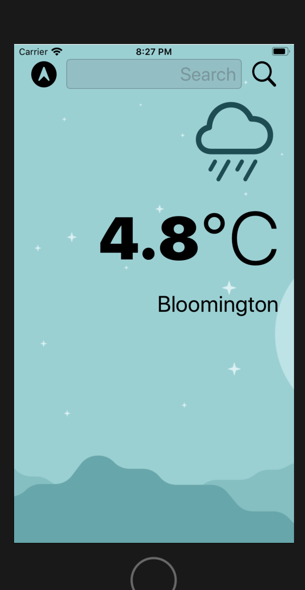

# Clima
Clima Weather App Clima Weather App Use URLSession to network and make HTTP requests. 
Parses JSON with the native Encodable and Decodable protocols. 
Uses Grand Central Dispatch to fetch the main thread. 
Uses Core Location to get the current location from the phone GPS.

Weather |
-------------------------- |
| 
